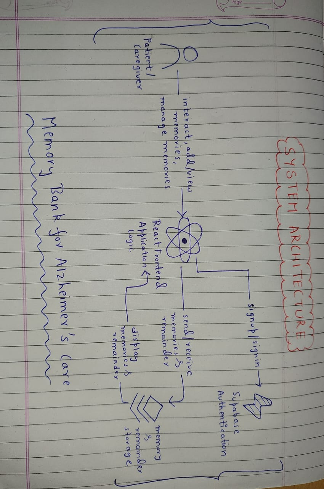
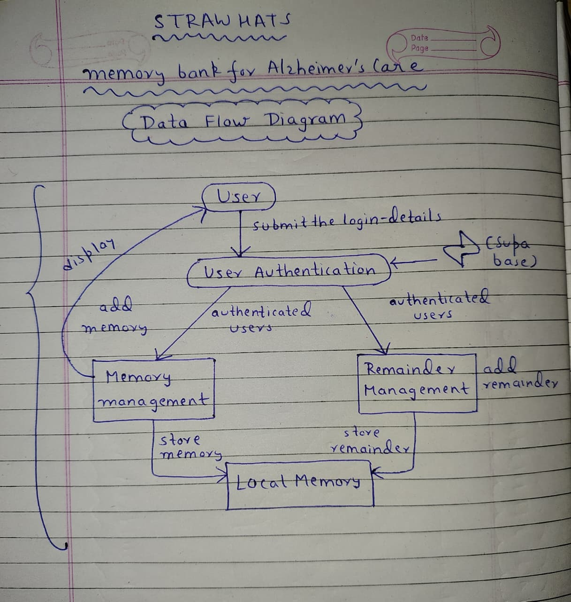
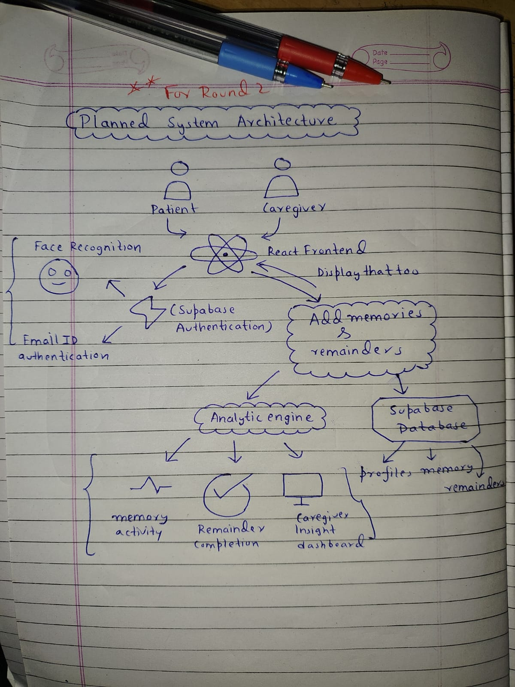

# HACK THE WINTER HACKATHON

## Project - Memory Bank for Alzheimer's Care App

### Problem Statement

Alzheimer’s patients gradually lose memory, routine awareness, and the ability to manage daily tasks independently. Caregivers struggle to constantly remind patients about medications, appointments, and personal moments, which increases emotional and physical stress.

There is a clear need for a simple, accessible digital system that helps patients preserve memories and maintain daily routines while reducing caregiver burden.

### Our Solution 

**Memory Bank for Alzheimer's Care** is a web application designed to help Alzheimer's patients and caregivers:
- **Preserve and relive memories** with photos, videos, audio, and notes
- **Authenticate securely and easily** using password-free face recognition
- **Set and manage reminders** for medications, appointments, and daily tasks
- **Track analytics** for memory and reminder usage
- **Simple, intuitive interface** tailored for elderly users and caregivers

Our Solution is mainly focused on assisting the Alzheimer's patients and caregivers with the three core themes:
1. *Easy authentication* (no cognitive overload).
2. *Memory preservation* (emotional and contextual recall).
3. *Routine support* (reminders and organization for daily activities, like taking medications and attending appointments, including personalized schedules and task tracking for caregivers to help manage patient routines and reduce caregiver burden).

### Solution Logic(How it Works)

1. **User Authentication**

Users sign up and log in using a simple profile-based authentication flow.

2. **Memory Creation**

Users add memories with a title, description, date, emotion, and optional media.
Memories are displayed in a timeline for easy recall.

3. **Reminder Management**

Users can schedule reminders for tasks like medication or appointments.
Reminders are categorized by status (active, snoozed, completed).

4. **Caregiver Visibility**

The system is designed to later allow caregivers to monitor memory and reminder activity, providing insights into patient activity and helping caregivers manage care routines more effectively.

### Diagrams:

#### System Architecture : 

#### Data Flow : 

#### Final System Architecture For Round 2:

### Features Implemented For Round 1

1. **User Authentication Using Supabase**
   - Secure sign-up and login using supabase authentication.
   - User profiles created and managed successfully.

2. **Memory and Reminder Management**
   - Add and view memories.
   - Create and view reminders for the daily tasks.
   - Right now, all the memories and the reminders are stored locally on the device.

3. **Simple and Accessible Interface and End-to-End Design**
   - Clean,minimal and easy-to-navigate UI.
   - Authentication -> Memory creation -> Remainder creation -> Data Viewing.

### Done Improvements for Round 2 [Done]

1. **Full Supabase Integration**
   - Memories and reminders stored using supabase PostgreSQL database.
   - Enable real-time data synchronisation across devices.
   - Apply Row Level Security (RLS) for patient-caregiver separation.

2. **Face Recognition Authentication**
   - Implement facial recognition for password-free login.
   - Fully integrate the facial recognition models in the prototype.
   - Store facial descriptors in user profiles.
   - Improved accessibility for patients with memory challenges.

3. **Analytics Dashboard** - Visual insights for memory activity and remainder usage.

4. **Media Support** - In Round-1, the memories support text, but we plan to expand to audio, images, and video in the future.

5. **Remainder Intelligence** - Status Tracking (active, completed and missed), Snooze and repeat patterns and notifications.

### Technology Stack

- **Frontend**: React.js with Tailwind CSS for responsive design
- **Backend**: Supabase (PostgreSQL, Auth, Storage)
- **Face Recognition**: TensorFlow.js or similar client-side ML library for facial recognition.
- **Deployment**: Vercel or similar for frontend, Supabase for backend

### Impacts

- **For Patients**: Easy, secure access; memory preservation; routine management
- **For Caregivers**: Insight into patient activity; reduced stress; better support.

### Prototype Screenshots
 
To demonstrate the functionality and working of the current prototype, all the screenshots are included in the [prototype-screenshots](prototype-screenshots/) directory.

1. ##### Login Page

2. ##### Add Memory Page

3. ##### Add Reminder Page

4. ##### Supabase Dashboard( user authentication)

5. ##### Analytics Dashboard

### Local Setup ( Optional )

This project requires Node.js (v16+) and npm.

1. Clone the repository.
2. Install all the dependencies: `npm install` 
3. Create a .env file in the root directory:
   - VITE_SUPABASE_URL=your_supabase_url
   - VITE_SUPABASE_ANON_KEY=your_supabase_anon_key
4. Start the development server: `npm run dev` 

### Team Name and its Members

- **Team Name**: Straw Hats

- **Members**: 
  - Sudhanshu Pratap - Team Leader & User Profile database design.
  - Priyanshu Bafila - Frontend Development & UI/UX Design
  - Vansh Jaiswal - Backend Development & Planning
  - Sanya Sharrma - Documentation,Testing and Research.